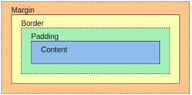

# CSS3

## Definições e Seletores
O CSS surgiu da necessidade de formatar as páginas de HTML, sendo assim ela é considerada uma linguagem de estilos.


Uma regra de CSS é representada por um Seletor ou grupo de seletores. É possível colocar vários seletores em uma regra, separando-os com uma vírgula:

```css
a, header{
  color: blue;
}
```

Nesse caso pegamos as âncoras \<a> e os \<header> e definimos uma cor a esses seletores, nesse caso o azul.

Vale lembrar que elementos HTML também podem sofrer alterações causadas pela interação do usuário, como o mover do mouse por cima ou clicar no elemento

```css
a:hover{
  color: red;
}
```
O a:hover do exemplo significa que a âncora também terá essa aparência quando o usuário passar o mouse por cima de um hyperlink

## id x Classe
No nosso index.html criamos uma regra que altera um elemento HTML diretamente mas isso significa que todos os elementos \<a> ficaram com aquela aparência, e normalmente temos sites mais complexos que que precisam de várias regras para elementos iguais. É aí que entram os seletores como **id** e **class**.

ID: é representado pelo símbolo #(hash) seguido de um nome para esse ID.

CLASS: Classe é representada de forma parecida com o ID, mas preenchida por um ponto(.) ao invés de hash(#)

E a diferença mais importante entre eles é a forma como devem ser usados: o ID só pode ser usado uma vez por página HTML enquanto que a classe não tem restrições.

## Box Model
Quando criamos o layout  de um site o navegador representa cada elemento HTML como uma caixa retangular, isso é o box model.



- As Margins são os espaçamentos entre elementos.
- Border se refere a borda.
- O padding é o espaçamento entre a borda e o conteúdo, a diferença para as margins é que declarações de imagem de fundo funcionam para ele.
- O content é o conteúdo do seu bloco de fato, ou seja, o texto, video ou imagem.

## Estilizando elementos
Caso quisermos atribuir valores diferentes ao _box_ nós temos 3 formas de fazer isso.

1. Colocando um valor para as partes superior e inferior e depois para os lados esquerdos e direito
```css
.post {
  margin: 10px 5px;
}
```
Os valores de 10 _pixels_ e 5 _pixels_ se referem respectivamento ao eixo y (lado superior e inferior) e x (lado direito e esquerdo)

2. A segunda forma é colocando valores para cada lado do _box_.
```css
.post {
  margin: 15px 10px 5px 0px;
}
```
Então começamos com 15px para o topo, passando 10px para o lado direito, depois 5px para o inferior e por último 0 px para o lado esquerdo.

3. A terceira forma é com propriedades específicas de cada lado, até agora tinhamos visto atalhos para essas propriedades.
```css
.post {
  margin-top: 15px;
  margin-right: 10px;
  margin-bottom: 5px;
  margin-left: 0px;
}
```

## Border
A propriedade border pode ter 3 valores: largura, cor e estilo, mas existem particularidades quanto a isso.

A largura pode ser usada em px, em e mm. A cor pode ser atribuida pelo nome ou por um código hexadecimal, e o estilo é representada pelas paravras-chave: _solid_, _dotted_, _dashed_.

Se não for desejado o uso de border, há propriedades específicas para cada aspecto da borda, são elas o _border-width_ para largura, _border-color_ para cor e _border-style_ para estilo.

Ainda é possível usar o _border-radius_ para arredondar os cantos de um elemento. Podemos usar várias unidades, mas as mais comuns são pixels e porcentagem.

## Estilizando textos

### font-family
Com o _font-family_ podemos alterar a fonte dos nossos textos com uma fonte da internet ou uma já instalado no computador. Vale notar que as chamadas _web safe fonts_ são encontradas em quase todos os sistemas, e podem ser utilizadas sem preocupação.

### font-size
_font-size_ nos ajuda a mudar o tamanho da fonte do texto

### font-style
Utilizado para mudar o estilo da fonte. Colocá-lo em itálico ou negrito ou retirar o estilo de algum elemento atribuindo como _normal_;