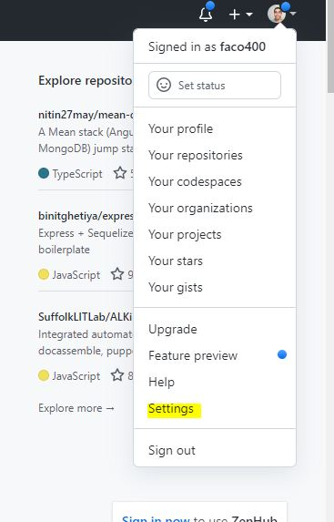
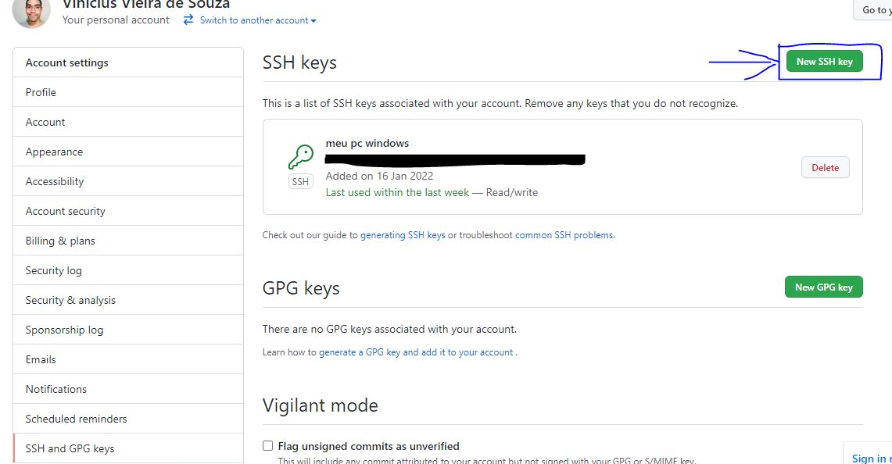
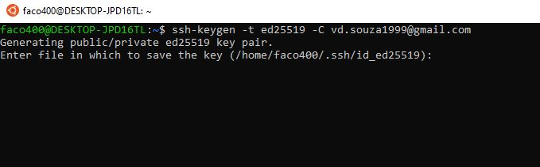
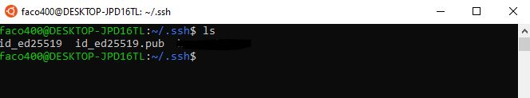
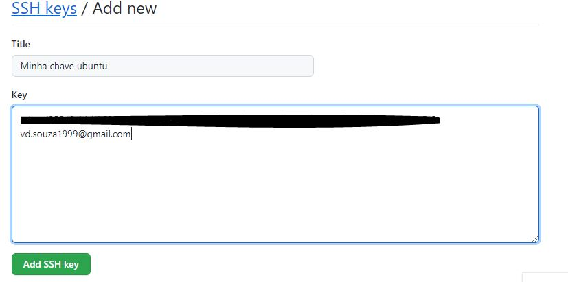
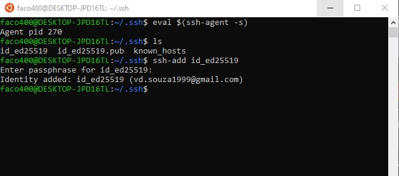
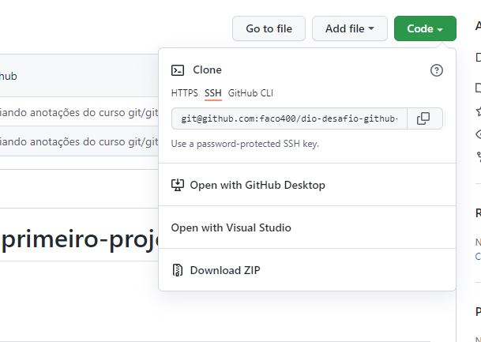

# Chave SSH e Token

## Passo 1
Vá até as configurações de perfil e selecione SSH E GPG para criar suas chaves no repositorio:

  

**Note** que para o meu caso já possuo uma chave SSH com titulo "meu pc windows" com a data em que foi criada e a última vez em que foi utilizada.

## Passo 2
Aqui iremos gerar as chaves SSH para nossa maquina. Portanto abra o terminal e insira o comando abaixo:

```terminal
ssh-keygen -t ed25519 -C <seu email do git aqui>
```

Você receberá a seguinte resposta:


Ele está pedindo para você inserir o local de armazenamento dessas chaves, para este guia não é necessário então simplemente clique em ENTER e siga para a próxima etapa.

Em seguida será soliciatado a inserção de uma palavra-chave que que será utilizada para realizar ao realizar commits (push, pulls e etc.). Fique a vontade para escolher essa senha. Após isso insira sua palavra-passe novamente e então pronto, chave SSH criada!

Em seguida, ainda no terminal, vá até o diretório de armazenamento das chaves SSH.

```terminal
cd /home/user/.ssh
```

Você pode lista-las com o comando "ls"



**Note** que foram criadas duas chaves SSH uma pública e outra privada

Utilize o comando: 
```terminal 
"cat id_ed25519.pub"
``` 
Copie o conteúdo da chave pública pois ela é que será inserida no github. Cole no espaço indicado e adicione um título.



# Passo 3
Agora é necessário inicializar o SSH agent, responsável por lidar com a chave da nossa máquina e do git para que elas funcionem. Portanto volte ao terminal e na pasta do SSH execute os seguintes comandos:



Pronto. Agora sua chave SSH já deve funcionar. No entanto é importante observar que toda vez que for clonar um repositorio não faça git clone pelo https e sim pelo SSH.

